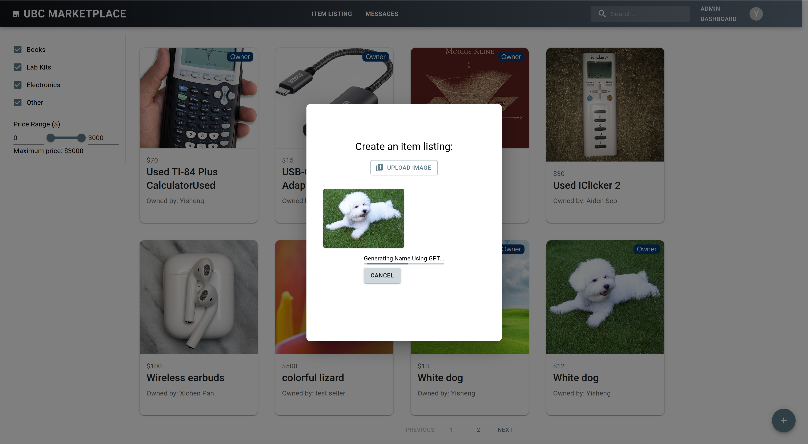

# Group 12 (Wait Blisters) - UBC Marketplace

> [!IMPORTANT]
> Check out [UBC MARKETPLACE](https://ubcmarketplace.hopto.org/)

## Project description

The **UBC Market Place** project is a secure online platform that facilitates buying and selling of items and services among UBC students and staff. It offers a seamless transaction experience with built-in order tracking and a system for reporting inappropriate activity. Other key features include:

- Email authentication methods restricted to UBC-affiliated personnel
- Automated and manual revision of items and users account to improve security and overall users' experience
- A chat function for easy communication between users
- Google Maps integration and auto-generated texts to assist users in creating orders

## Project Overview

Home Page - A preview of the platform

Signup - A design choice was made to ensure only UBC-affiliated users are able to signup

Chat GPT - AI generated texts are created when an image is uploaded

Admin Dashboard - A page dedicated to authorized users to view reported items and manage them

Admin Dashboard - A page dedicated to authorized users to view reported items and manage them

My Listings - Show all posted items by the current user and provide edit, delete and select operations

Detail View - Show detail description to the items, supporting multiple images by clicking on images left and right icons, Google Maps, and three operation buttons

## Team Members

- **Yisheng Liu**: [:octocat:](https://github.com/liuyishengalan) Yisheng has an Operating Systems and ASIC design background. He is also passionate about full-stack development and has experience with React Native development.
- **Xichen Pan**: [:octocat:](https://github.com/xichen1) Xichen is interested in fullstack development, and distributed systems, especially the blockchain ecosystem.
- **Kate Saychaleun**: [:octocat:](https://github.com/KeitoKat) Kate is most comfortable with presentations, communication, organization, and logistics. She has experience in graphic design and works with ReactJS, HTML, CSS, JavaScript, and more. She aims to explore backend tools and become well-versed in full-stack development.
- **Aiden Seo**: [:octocat:](https://github.com/sn14188) Aiden is interested in front-end, back-end, AI, and ML. He aims to broaden his knowledge by learning applied industry skills.

### Technical Functionalities in detail

The platform will store users information (such as user ID, username, email, number, and ratings: sell, buy, services) and products information (product ID, product category, product name, product condition, product description, product price, trading location), as well as transaction and chat records. Users will be able to view product details, identify and contact trading partners, manage their listings, and communicate with sellers.

- **Who is it for?**
  - For UBC students, UBC staff, app admin
- **What will it do?**
  - Display product information for users to buy, sell, and exchange services
- **What type of data will it store?**
  - User information (user ID, user name, email, number, gender, major, year level, avatar, ratings: sell, buy, services)
  - Item information (item ID, item category, item name, item condition, item description, item price, transaction location, views…)
  - Order records
  - Chat records
  - Reported records (only for admins to moderate)
- **What will user be able to do with this data?**
  - To learn about the product details.
  - To know who you are trading with.
  - To contact the seller/buyer.
- **What is some additional functionality you can add/remove based on time constraints?**
  - ADD: Private chat box between the seller and the buyer
  - ADD: AI integration for recommendation system
  - ADD: Verification using student/staff emails ending with ubc.ca
  - REMOVE: Voip System

## Project task requirements

### Minimal requirements

- Users should be able to **add new item listings** with required fields: item name, price, description, and whether it is for sale or trade
- Users should be able to **view all item listings**
- Users should be able to **delete their item listings**
- Users should be able to **edit their item listings**
- Each listing created should **have an automated ID** assigned to it

### Standard requirements

- Users should be able to **create and manage their profiles** with required fields: username, email, phone number, and password
- Users should be able to **delete their profile** from the marketplace
- Users should be able to **edit their account info**: name, mobile number, password
- Users should be able to **filter items** based on criteria such as item name, item categories, item price
- Users should be able to **search for items** using item name
- Only verified identities can **log in** (e.g. UBC students, staff) using a **UBC-affiliated email** including but not limited to ubc.ca, student.ubc.ca, ece.ubc.ca, cs.ubc.ca, and alumni.ubc.ca

### Stretch requirements

- Users can **communicate and negotiate directly** on the platform chat system (ie. texting, sending images)
- Items will be **assigned a location** for pickups (using Google Maps)
- **Location** should be **automatically fetched** when user clicked the location button on the post new page
- The integrated AI(GCP API) should **ban all sensitive contents in new posts** by auto-moderating the input fields: name, description, and location
- Users should have the ability to **report items** manually with their reason
- Users should have the ability to **report users' profiles** manually with their reason
- Admin should be able to handle reported items and users in a **moderation system UI** manually
- Users and buyers can **track their orders and confirm** that the orders are completed
- ChatGPT built-in feature will **provide suggested text** on item name

### Above and beyond

- Allow users to archive their profile (alternative for Delete profile)
- Archive items when a user is archived
- Archive items when an order is "completed"

## Minimal requirements breakdown

- Users should be able to add new item listings with required fields: item name, price, description, and whether it is for sale or trade
  1. Retrieve values from the user’s input form in the front-end
  2. Validate data (eg. price can’t be negative)
  3. Store data in the NoSQL database
- Users should be able to view all item listings
  1. Retrieve values from the database
  2. Convert the values into JSON format
  3. Display all item listings in a table or a list
  4. Add an error handler to ensure our data was retrieved properly (eg. 404 error)

## Rough sketch prototypes

## Tech learned throughout the term (Units 1-5)

- **Unit 1**

  - **Tech tools: HTML, CSS, Javascript**
    - HTML is provided in the Vite framework by default, so we did not have to manually make it. While it was not used as much throughout the project, we sometimes needed to change things globally. For example, we changed the `title` to our project name
    - Our team relied mostly on Material UI library for styling. Although, sometimes CSS is more handy in modifying things globally
    - Javascript is well integrated in other tools like React, Node.js, etc. It was used throughout the project, so knowing the syntax was quite important
  - **Organization tools: Trello, Google Doc, Github, Slack**

    - Trello was used to assign roles to each member and keep track of tasks
    - Slack was used for communication and keeping track of important links. It was later used to replace Trello for notifying the team when a new pull-request is pushed. This was more efficient because everyone checks Slack more often and it is easier to resolve any urgent issue using the thread function
    - Google Doc has always been the main documentation means for the team. Every assignments is documented in a seperate Google Doc and shared with the team prior to our meeting. The doc is important, because it allows us to visualize our tasks and refer to them after each meeting
    - Github branches are generally seperated by features. Once a feature is successfully merged with no issue, each team member is responsible for cleaning up the branches they have created. This is done by either deleting the branch or modifying them when necessary

  - **Design tool: Lucid Chart**
    - Lucid Chart was used to create our low-fidility prototype at the very beginning. This encouraged us to brain-storm together and allowed us to visualize the flow of our application as a team

- **Unit 2**
  - **Front-end tools: React, Vite, Redux, Material UI library**
    - React states were helpful at the beginning when we had to store our data locally. React is also a robust language that has a vast library and extensions, making it easier for us to work with
    - Vite provided us with a useful framework that worked well with React. Vite is also fast, so it saved us a lot of time
    - Redux is a good addition that helped keep all of our states organized in one place, making it easier to debug as well
    - Material UI library beautified the components that we used and kept the UI consistent
  - **Design tool: Figma**
    - Figma was also used to create our low-fidility prototype in later Progresses. Figma was a little easier to use than Lucid Chart as it has a preview feature. This was useful in visualizing complex interactions between features
- **Unit 3**
  - **Back-end tools: Node.js, Nodemailer**
    - Node.JS, Express.JS worked as the core framework of our backend supporting the basic functions as endpoint
    - Nodemailer was used to streamline the authentication process, because it acted as the middle-man to send the users the correct authentication code
- **Unit 4**
  - **Back-end tools: MongoDB, Express.js, Cloudinary, Google Maps API, Google Cloud Platform AI API, OpenAI API**
    - We used Cloudinary to save and host our user images instead of saving base64 data directly in our MongoDB database
    - We used Google Maps API to provide visual location information for pick up around the campus other than providing raw text. We ask plain text during post items.
    - We use GCP AI API and OpenAI API for moderation system and text generation recommendations
    - Many students have made suggestions to enhance our features. Our APIs were additional features generally used to support with text generation and data moderation
- **Unit 5**
  - **Deploy: CI/CD, NoIP (domain), Vercel, Render.com**
    - CI/CD build and production deployment allowed for more streamlined code base dependencies. The process also allowed us to detect errors before our branches were merged
    - NoIP was used to create a free custom domain for our project. The free version of the domain worked perfectly with Vercel. However, some advanced features were exclusive to subscribed members, which we do not have access to
    - Vercel and Render.com were useful in deploying the front and backend of the project. Vercel took a little longer to deploy and required a PRO subscription (due to Github organization restriction). But, once set-up, the preview environment allowed us to check for bugs similar to testing the code using localhost

### List of contributions

> [!NOTE] > [Link](https://drive.google.com/drive/folders/1FwIRAi1B8igjujDz1wPk07CurZzYprmd?usp=sharing) to full documentation ordered by each sprint

- **Yisheng Liu**:
  - Worked on:
    - **Low-Fidelity Prototype**:
      - Contributed to the low-fidelity prototype in the early stage of the project.
    - **Frontend Contributions**:
      - Designed and implemented a modern UI for the project using **Material UI**, adding animations and proper content in the footer.
      - Designed and implemented the view for listing all items with Redux integration and **pagination**.
      - Designed and implemented a modern, animated welcome page.
      - Integrated filter and search bar components into the frontend with real functionalities.
      - Enhanced filter and search bar functionalities by adding a minimum price option.
      - Designed and implemented the detail page UI with pop-up modal components, featuring multiple images, price, **Google maps**, and action buttons for buy, chat, and report.
      - Designed and implemented the **Admin Dashboard** view, including Manage Post, Manage Item Reports, and Manage User Reports tabs, where administrators can fully manage users and items and check all tickets submitted by users.
      - Designed and implemented the report entry feature for users to submit tickets reporting **malicious behaviors** on user **profiles** and **items**.
      - Added an **ownership badge** on item cards indicating the item belongs to the current logged-in user.
      - Added a **progress bar** when users are waiting for AI-generated content from the ChatGPT API, along with a cancel button for long waits.
      - Added a browser real-time locater to automatically get users' current location when users are posting their items
      - Moved auto-filled AI-generated content to a Material Chip component, allowing users to decide if they want to use the generated content.
      - Enhanced and implemented functions in the post new items view to check **content sensitivity** using Google Cloud Platform AI APIs. Users cannot post content that violates the policy.
      - Designed and implemented the sign-up view, enhancing the initial registration UI by enforcing the use of **ubc.ca domain** names, adding optional faculty or student sub-domain names, implementing strong password checking, and password matching checks.
      - Designed and implemented the sign-up and login mechanisms in the frontend, checking if the email has been verified. If not, a pop-up window asks if the user wants to receive another verification email.
      - Enhanced user login credentials on the frontend, improving the login and sign-up flow.
    - **Backend Contributions**:
      - Designed and implemented backend endpoints and frontend API calls for **item fetching**.
      - Designed and implemented backend endpoints and frontend API calls for item **searching and filtering** by price range and keywords.
      - Designed and implemented backend endpoints and frontend API calls for **sign-up and login mechanisms**.
      - Designed and implemented backend endpoints and frontend API calls for the **moderation system** (reporting and resolving tickets).
      - Designed and implemented backend endpoints and frontend API calls for the **email verification system** using Nodemailer for **UBC-only** email accounts.
      - Designed and implemented backend endpoints and frontend API calls for uploading images using the **Cloudinary platform** to host and store images for chats and item postings.
      - Embedded **Google Maps API** to show pickup locations on the detail page.
    - **CI/CD Deployment**:
      - Deployed the backend using **Render** services.
  - Challenges:
    - Faced difficulty in selecting a proper UBC identity verification method. CWL is only available after a time-consuming application process, so I implemented the verification system and account management system independently.
    - Faced difficulty in selecting a proper image hosting system. After discussing with Xichen, we decided to use Cloudinary, which is free and has no usage limits given our current access needs.
- **Xichen Pan**:
  - Worked on:
    - Developed a low-fidelity prototype for the item list page to visualize the basic layout and design
    - Established development tooling including setting up **ESLint** and **Prettier** for code formatting, along with configuring the backend using **Express.js** and **MongoDB** for data storage
    - Created the initial version of the **login UI**, integrating local verification functionality using **Redux** for state management
    - Implemented an **item card UI** that allows users to view essential information and images related to the items
    - Designed and implemented the UI, backend endpoints, and database schema for managing **conversations and chats**, while continuously testing and debugging to enhance robustness
    - Contributed to the **CI/CD** setup for frontend deployment by configuring environment variables and troubleshooting issues in the CI/CD workflow
  - Challenges:
    - Encountered a learning curve with Redux, which initially made it challenging to identify and apply best practices effectively
    - Faced difficulties in implementing separate databases for development and production environments due to time constraints and lack of a detailed implementation plan
    - Experienced challenges in designing and implementing an user interface with good user experience and appearance, necessitating further study and practice in UI design principles
- **Kate Saychaleun**:
  - Worked on:
    - Organize meetings and helped document tasks during meetings. (See full documentation with the link above)
    - Contributed in project prototype designing and writing Github documentation. [Sample work](https://www.figma.com/design/Yyss7ygKE6P2Lv9Gzz4s0T/Untitled?node-id=0-1)
    - Implemented the front-end for components such as:
      - `Input Fields` to add an item to the listing
      - `Search Bar` to search an item
      - `Slider` for filtering items based on a price range
    - Other contributions:
      - Dispatched `Add` function so the inputField properly stores item data
      - Enabled multiple images to be uploaded/posted
      - Integrate **ChatGPT API** to auto-generate out item name based on image provided
      - Setup **CI/CD** pipeline
      - Deployed the project front-end on **Vercel** and link it with a custom domain using **NoIP**
      - Enable profile archiving so users don't have to permanently delete their profile
      - Enable items to be archived when an order is completed or when a user is archived (item will also disappear from the user's conversation)
      - Contributed in refining the filter function by aligning the front-end input field, `Categories`, with back-end `FilterLeftBar` function
  - Challenges:
    - This is my first time using backend tools like MongoDB, Express JS, and the OpenAI API. I spent a lot of time learning and debugging, and sometimes I ran into bugs. Fortunately, my more-experienced teammates were there to provide guidance and feedback along the way
    - It is also my first time working with a system that has a fully-implemented authentication process, so I couldn't log in to our account for a while. My teammates helped explain how the process worked during our meeting, and I was finally able to view and post items as an authorized user
    - I was working on deployment, so naturally, I wanted to deploy the backend as well. However, I kept running into issues, so a teammate took over the backend setup, resulting in front-end and back-end working properly in the end
    - During deployment, I kept running into issues due to subscription restrictions from Vercel and NoIP. I ended up using the free trial version on Vercel to access the necessary features, such as accessing our project repository and sharing the project with teammates within our Github organization. I continued using the free version on NoIP, but there is no major issue with that
- **Aiden Seo**:
  - Worked on:
    - Documented the initial project ideas from the team members and migrated them to initialize the team project repository
    - Front-end work: focused on implementing core functionalities of the platform, such as user and item management using MUI components
      - `Header`/`Footer` and `Navbar` for basic web platform look and design
      - User-related components: `AccountMenu`, `SignUp`, `ProfilePage` (including `UserProfile` and `UserDashboard`), `MyListing` and more
      - Order-related components: `Order`, `OrderList`, `OrderRecords` to handle actual transactions
      - Implemented redux actions mostly for users, items, and orders
    - Back-end work:
      - Update/Delete user in the database; including related contents (Items, Messages, Conversations, Orders)
      - Update/Delete item in the database
      - Implemented Order Tracking functionality: managed the entire implementation, including Redux to interact with the database, allowing users to view their transactions and history
  - Challenges:
    - Learning Curve and New Tech Adoption:
      - Since this was my first time implementing such a professional full-stack application, it took a significant amount of time to study and develop the functionalities. Additionally, the team members were highly skilled and used advanced technologies like Authentication systems with Nodemailer, Cloudinary, and chat systems, which I also needed to understand and learn.
    - Handlig Errors and Bugs:
      - I was not familiar with handling errors and bugs that occurred after deploying the app, both locally and online. Deployment itself was challenging as well making thorough testing difficult. But with the help of my team members we managed to resolve these issues.

## What's Next

- Enable real-time chat
- Pop-up window notification system for users when they receive a message or order status update
- Robust ordering system (Right now, many orders from different users can be created with one item. If we have time, we’d like to ensure only one of them show up at a time)
